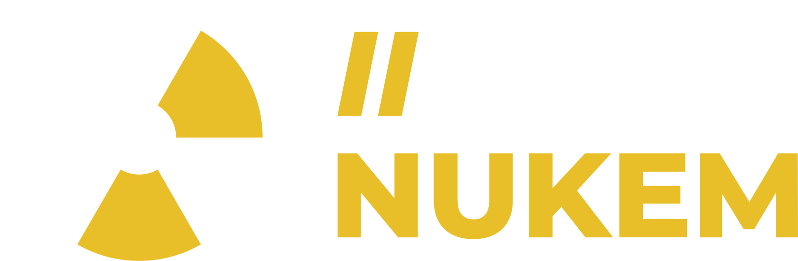
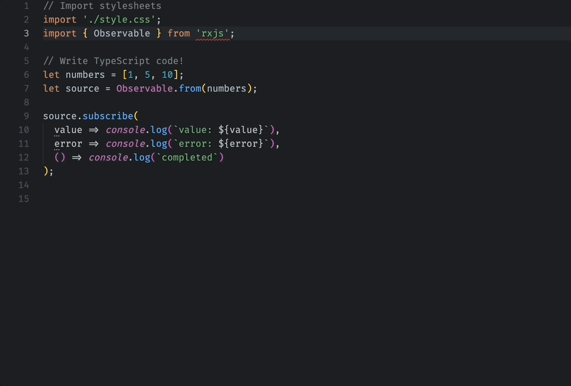

    <picture>
        <source media="(prefers-color-scheme: dark)" srcset="./images/todonukem-dark.png">
        <source media="(prefers-color-scheme: light)" srcset="./images/todonukem-light.png">
        
    </picture>

# Coding Comments Snippets

**Working Draft**

A snippet extension for generation TODO messages with emojis for easier comprehension and organization, see [TODO NUKEM Convention](https://github.com/jolution/todo-nukem/blob/main/README.md).

### 🎬 Demo

#### Generate Comment

## 📰 Installation

Install this extension from the [VSCode Marketplace](https://marketplace.visualstudio.com/items?itemName=jolution.todo-nukem-snippet-vscode)

## ❤️ Support

If you find this project helpful, please consider giving it the Convention Repo a star on [GitHub](https://github.com/jolution/todo-nukem).

We do not currently offer direct support for this project.

## 🗺️ Roadmap

- Publish this package to the Visual Studio Extension Store
- Add optional block support

### ✍️ Authors (in alphabetical order)

- [@juliankasimir](https://www.github.com/juliankasimir)
- [@pimmok](https://www.github.com/pimmok)

## ⚖️ License

See the [LICENSE](LICENSE) file for details.

## ℹ️ Disclaimer

Please note that this project, TODO NUKEM, is not officially associated with or endorsed by the Duke Nukem franchise or its creators. It is an independent project developed by the open-source community and does not claim any rights to the Duke Nukem trademark or any related materials.
